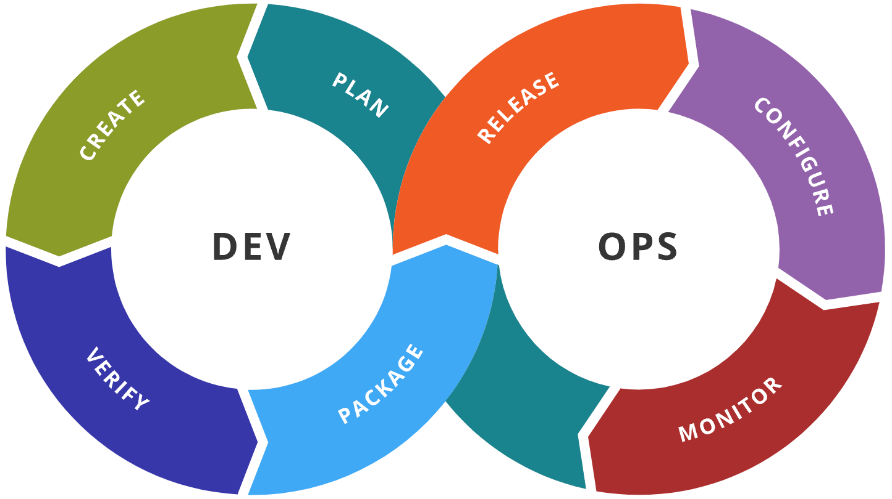

# DevOps

- Dev (development) + Ops (operations) combined
- The release, configuration, and monitoring of software is in the hands of the people who develop it
- Goal: bridge the gap between Dev and Ops through CI/CD and automation

