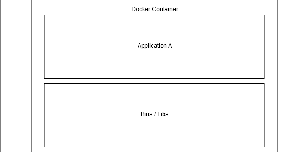

# What is Docker?

- A set of tools to deliver software in containers using OS-level virtualization
- Containers package the application together with all its dependencies (bins/libs)
- Containers are isolated from each other and from the host system
- Docker provides tools to interact between containers and the host when needed

