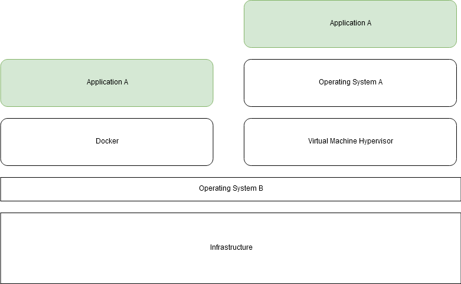

# VM vs Container

## Virtual Machine (VM)
A Virtual Machine runs on a hypervisor, which virtualizes the physical hardware. Each VM includes a full operating system along with its own binaries and libraries. This makes VMs heavy and slow to start. However, they provide strong isolation and are well suited for running multiple different OS environments on the same machine.

## Container
Containers share the host machine's OS kernel instead of running their own. They only package the application and its dependencies. This makes containers lightweight and fast to start. Their isolation is at the process level, which is not as strong as VMs, but sufficient for most use cases.

## Key Differences
| | VM | Container |
|---|---|---|
| Startup time | Minutes | Seconds |
| Size | GBs | MBs |
| OS | Full OS per VM | Shares host OS kernel |
| Isolation | Strong (hardware level) | Process level |
| Portability | Lower | High |

## Docker on macOS / Windows
Docker relies on the Linux kernel. macOS and Windows cannot run Docker natively. Each has its own solution — for example, Docker for Mac runs a Linux VM under the hood, and Docker operates inside that VM.
