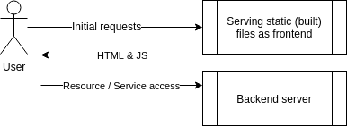

# Exercise 2.3 - Project with Compose (mandatory)

In Exercise 1.14 you created Dockerfiles for both frontend and backend.

Now use Docker Compose to start both services with one command.

- Frontend connects to backend via `REACT_APP_BACKEND_URL`
- Backend allows CORS from frontend via `REQUEST_ORIGIN`

Submit the `docker-compose.yaml`.

> Note: This exercise is mandatory for course completion.
