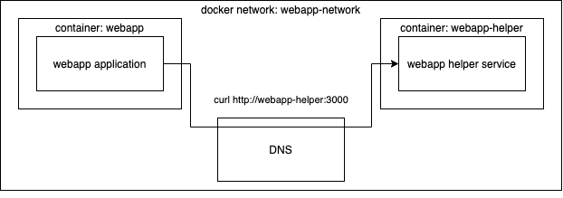

# Docker Networking

Docker Compose automatically creates a shared network for all services defined in the same `docker-compose.yaml`. Each service is reachable by its **service name** via internal DNS — no port publishing needed between containers.

## How it Works

- `webapp` sends a request to `webapp-helper:3000`
- Docker's internal DNS resolves `webapp-helper` to the correct container IP
- Port 3000 does **not** need to be published to the host

## Key Rule

Only publish ports (`ports:`) for services that need to be accessed from **outside** (browser, external tools). Internal container-to-container traffic stays inside the network.
