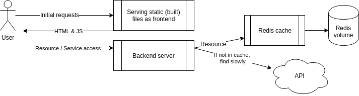

# Exercise 2.4 - Redis (mandatory)

Expand the configuration from Exercise 2.3. Configure the backend to use Redis as a cache.

## Architecture

## Rules

- Do **not** publish Redis ports to the outside world
- Backend connects to Redis internally via service name
- Use `restart: unless-stopped` on the backend in case Redis takes time to start

## Hints

- Check the backend README for Redis configuration env variables
- Redis image docs may have useful info

Submit the `docker-compose.yaml`.
