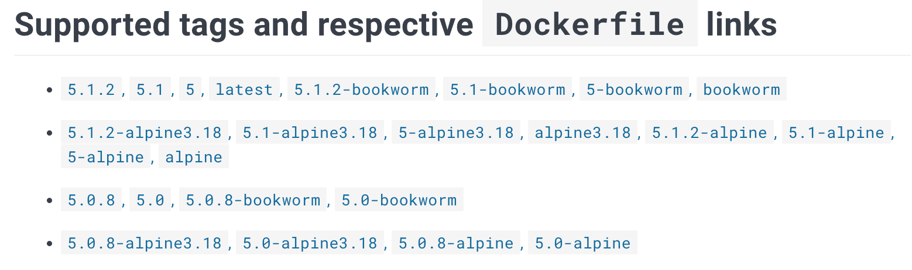
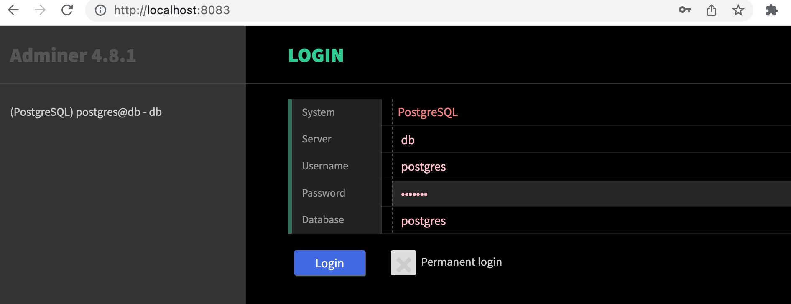

# Example: Redmine + Postgres + Adminer

A real multi-container setup: project management app, database, and a DB admin UI.



## docker-compose.yaml

```yaml
services:
  db:
    image: postgres:13.2-alpine
    restart: unless-stopped
    environment:
      POSTGRES_PASSWORD: example
    volumes:
      - database:/var/lib/postgresql/data

  redmine:
    image: redmine:5.1-alpine
    environment:
      - REDMINE_DB_POSTGRES=db
      - REDMINE_DB_PASSWORD=example
    ports:
      - 9999:3000
    volumes:
      - files:/usr/src/redmine/files
    depends_on:
      - db

  adminer:
    image: adminer:4
    restart: always
    environment:
      - ADMINER_DESIGN=galkaev
    ports:
      - 8083:8080

volumes:
  database:
  files:
```

## How it connects

- `REDMINE_DB_POSTGRES=db` → Redmine connects to the `db` service by name via Docker DNS
- `db` has no `ports:` → not accessible from outside, only from within the network
- Adminer at `localhost:8083` → graphical DB interface, connects to `db` using the service name



## Key points

- Named volumes `database` and `files` persist data across `docker compose down`
- `depends_on: db` ensures Postgres starts before Redmine
- Publishing ports is only needed for services accessed from **outside** Docker — internal communication uses service names
