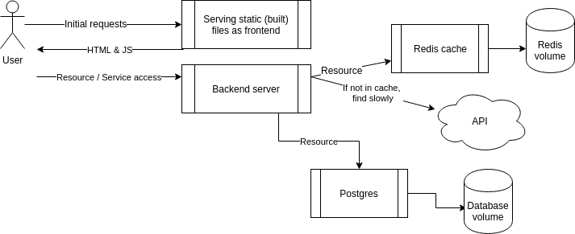

# Exercise 2.6 - Postgres (mandatory)

Add a PostgreSQL database to the example backend from Exercise 2.3.

## Architecture

## Instructions

Expand the `docker-compose.yaml` from Exercise 2.4 (frontend + backend + Redis) to also include a Postgres database for the backend.

- Use the official `postgres` image
- Check the backend README for the required environment variables
- The backend should connect to Postgres using the service name as hostname

Submit the `docker-compose.yaml`.
