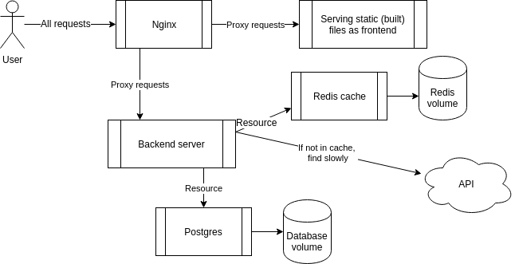

# Exercise 2.8 - Nginx (mandatory)

Add an Nginx reverse proxy in front of the frontend and backend. All traffic should go through port 80 only.

## Architecture



## Instructions

- Add an `nginx` service to the compose file
- Mount an `nginx.conf` into `/etc/nginx/nginx.conf`
- Nginx listens on port 80 and routes:
  - `/` → frontend
  - `/api/` → backend
- Remove `ports` from frontend and backend — only Nginx is exposed

## nginx.conf template

```nginx
events { worker_connections 1024; }

http {
  server {
    listen 80;

    location / {
      proxy_pass _frontend-url_;
    }

    location /api/ {
      proxy_set_header Host $host;
      proxy_pass _backend-url_;
    }
  }
}
```

Submit the `docker-compose.yaml`.
