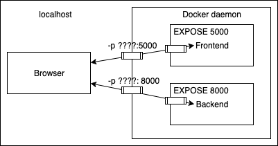

# Exercise 2.9 - Fix Connections (mandatory)

Ensure all buttons in the application work correctly through the Nginx proxy.

## Instructions

- With the setup from Exercise 2.8, open the app at `http://localhost`
- Check that all buttons function — test via browser developer console if something fails
- Review the backend README for any missing configuration
- Hint: try `http://localhost/api/ping` in the browser to test backend connectivity

Submit the `docker-compose.yaml`.
