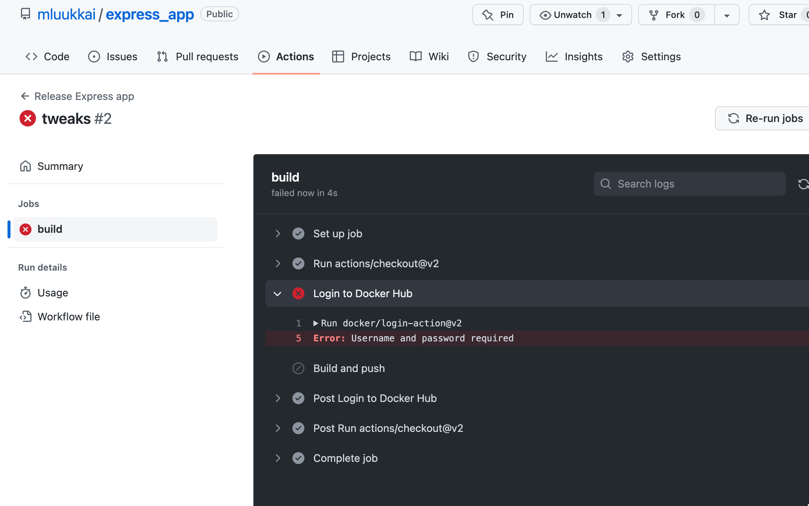

# GitHub Actions

GitHub Actions runs automated workflows triggered by events (e.g. push to master).

## Workflow File

Saved at `.github/workflows/deploy.yml` in the repository:

```yaml
name: Release DevOps with Docker

on:
  push:
    branches:
      - master

jobs:
  publish-docker-hub:
    name: Publish image to Docker Hub
    runs-on: ubuntu-latest
    steps:
    - uses: actions/checkout@v2

    - name: Login to Docker Hub
      uses: docker/login-action@v1
      with:
        username: ${{ secrets.DOCKERHUB_USERNAME }}
        password: ${{ secrets.DOCKERHUB_TOKEN }}

    - name: Build and push
      uses: docker/build-push-action@v2
      with:
        push: true
        tags: username/imagename:latest
```

## How it works

1. `on: push: branches: master` → triggers on every push to master
2. `actions/checkout@v2` → checks out the repo code
3. `docker/login-action` → logs into Docker Hub using secrets stored in GitHub
4. `docker/build-push-action` → builds the image from the Dockerfile and pushes it

## Secrets

Never put credentials in the workflow file. Store them in GitHub → Settings → Secrets:
- `DOCKERHUB_USERNAME`
- `DOCKERHUB_TOKEN`



## Security Warning

Anyone who can push a malicious image to Docker Hub gains indirect access to your server — Watchtower will automatically deploy it. Guard your Docker Hub credentials carefully.
